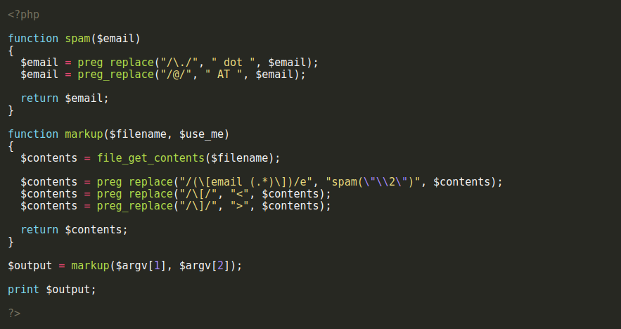
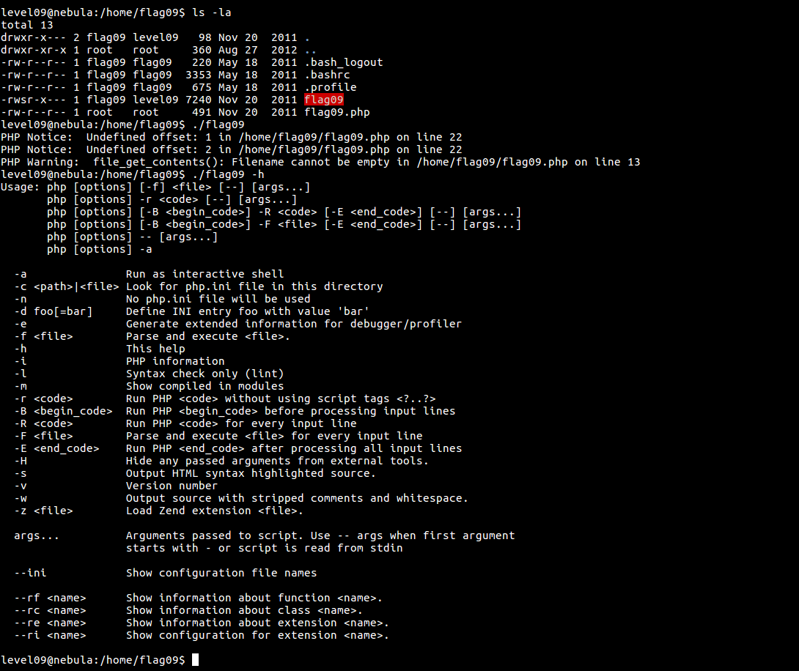

# LEVEL 09 Writeup

# `Source Code`

Bu seviye için level09 kullanıcısına geçmeniz gerekmektedi. `username : level09 password : level09` . Bu seviyeye ait dosyaları `/home/flag09` dizininde bulabilirsiniz.

Bu sefer bizi PHP kodu karşıladı :). PHP kodumuzu çalıştıran bir C setuid sarmalayıcısı olduğunu söylemiş soruda bize.

İlk çalıştırdığımızda bazı hatalar verdi. Biraz uyanıklık yapıp `-h` parametresini veriyoruz. İncelediğimiz zaman `-a -r` gibi parametrelerle hızlıca bu seviyeyi de çözebiliriz gibi duruyor.

Malesef bu yol bizi doğru sonuca götürmedi :/ O zaman incelemeye devam edelim bakalım başka ne bulacağız.

Kodumuzu inceleyecek olursak PHP kodumuz `[email alp@eren.com]` gibi bir formattaki dosyayı okuyarak birkaç regex işleminden sonra yazdırıyor. O zaman bizim burada PHP kodumuzun içerisinde ki zafiyetli kısmı bulmamız gerekmekte.

Zafiyetli kısım ise şu satıra denk geliyor...

    $contents = preg_replace("/(\[email (.*)\])/e", "spam(\"\\2\")", $contents);

**

Buradaki sıkıntı `preg_replace` da `/e` kullanımından kaynaklıymış. preg_replace normal parametreler ve değerler ile işlemi gerçekleştirdikten sonra PHP parametresi olarak `eval()` fonksiyonunu çalıştırmak isteyen PCRE değiştiricisi oluyormuş. Açıkçası bu noktayı ben de tam olarak anlamadım. Detaylı incelemek isteyen olursa şuraya linki bırakayım

https://www.php.net/manual/en/reference.pcre.pattern.modifiers.php

Herneyse kısaca çözüm şu şekilde olacakmış...

