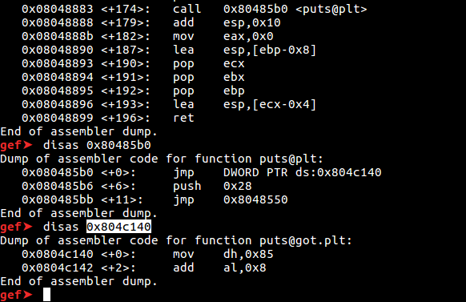

# Heap One Writeup

# `Source Code`

Bu soruda diğerinden farklı olarak bizden 2 argüman almakta ve belirli bir sayıda karakter alan bir buffer'ımız yok. Direk malloc ile ayrılmış alanlara müdahale edeceğiz.

Şimdi yapacağımız şey 8 byte'lık ilk malloc adresini taşırarak ikinci malloc adresinin üstüne istediğimiz adresi/shellcode ' u yazacağız. ( i1 name'e ait 8 byte'lık malloc adresini taşıracağız ve i2 name'e ait malloc adresi yerine yazacağız)

Daha basit anlatacak olursak strcpy komutumuz strcpy("GOT içerisinde olan adres", "winner fonksiyonumuzun adresi") haline gelecek. Bu sayede atlanmak istenen GOT adresi yerine programımız vermiş olduğumuz winter adresine atlayacak.

Öncelikle bizden aldığı ilk argümanda kaç karakterden sonra geri dönecek ona bakalım.

20 karakterden sonra gelen FFFF karakterlerini döndürdü. Yani şu demek ben i1 name malloc adresine 20 karakter yazdıktan sonra i2 name malloc adresine yazabilirim. Artık winner fonksiyonumuzun adresini ve GOT içerisinde olan adresimizi bulup exploitimizi yazabiliriz.

`Winner`

`Global Offset Table`

Değerlerimizi ilgili yerlere yerleştirip exploitimizi çalıştıralım

Ve başarılı bir şekilde winner fonksiyonumuzu çağırıp çalıştırdık.

NOT : Daha detaylı anlatım için [Protostar Heap One Writeup](../Protostar/Heap1.md) yazıma bakabilirsiniz. 

# `Exploit`

`i486`

    ./heap-one $(python -c 'print "A"*20 + "\x40\xc1\x04\x08" + " "  + "\x9a\x88\x04\x08"')
**    
