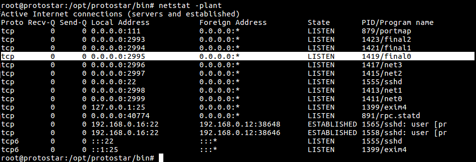
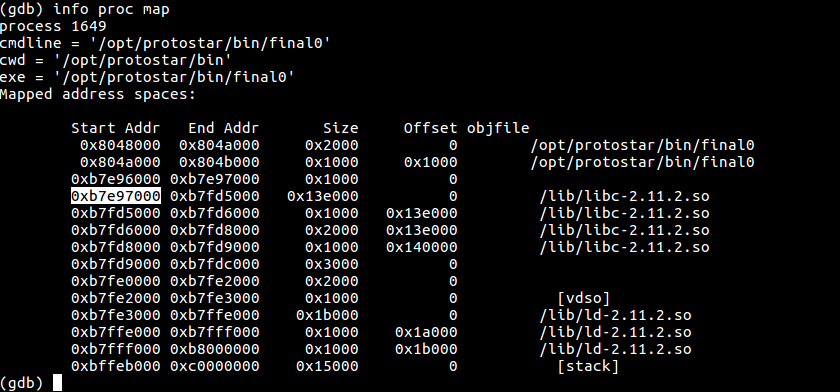
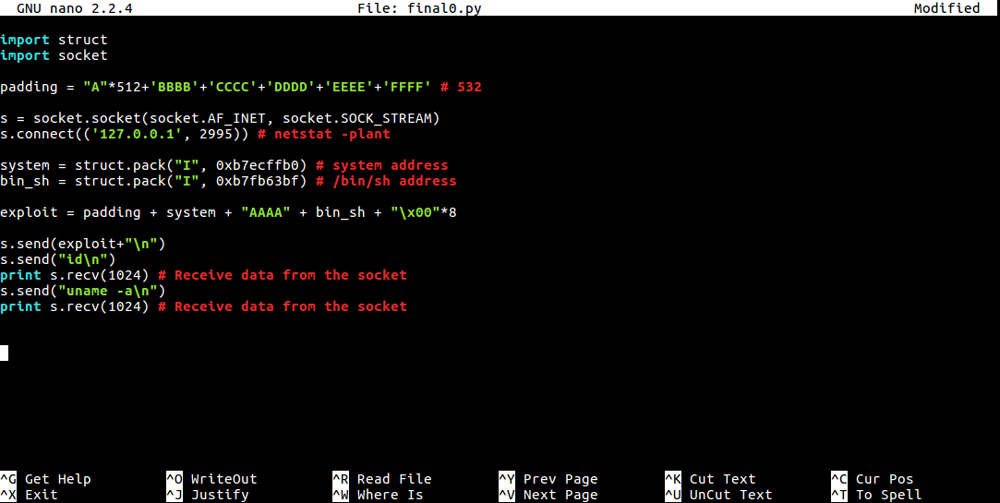
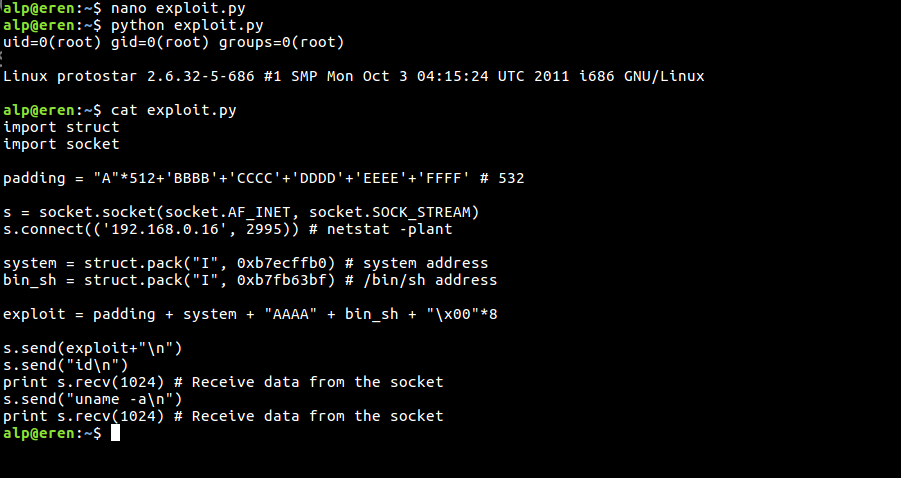

# Final Zero Writeup

# `Source Code`

Daha önce ayrı ayrı uygulamış olduğumuz `stack overflow` ve `network programming` konularından faydalanarak `remote buffer overflow` zafiyetinden faydalanmamız beklenmekte.

root kullanıcısına geçiş yaptıktan sonra `netstat -plant` sonra `final0` programımızın çalıştığı portu `2995` olarak buluyoruz.

Soruda `512` karakterlik bir `buffer`ımız var. `buffer`ı taşırıp `eip` üzerine yazmamız gerekiyor. Bunun için `buffer`ı taşırdıktan sonra kaç karaktere daha ihtiyacımız var onu öğrenelim.

    echo `python -c "print 'A'*512+'BBBB'+'CCCC'+'DDDD'+'EEEE'+'FFFF'+'GGGG'"` | nc 127.0.0.1 2995

    dmesg | tail -1    

`0x47` => `G` . Ve `532` karakterden sonra `eip` üzerine yazabileceğimizi görmüş olduk.

Ufaktan exploitimiz yazmaya başlayalım...

NOT : Burada iki farklı yol var. Dilerseniz direk `shellcode` çalıştırabilir veya `ret2libc` saldırısını kullanabilirsiniz

Ben `ret2libc` üzerinden anlatacağım.

Önce `libc system` adresini bulalım.

    (gdb) p system

Daha sonra `/bin/sh` adresini bulalım

    gdb final0
    break *main
    run
    info proc map

**

    strings -a -t x /lib/libc-2.11.2.so | grep "/bin/sh"

Şimdi bu iki değeri toplayalım

    (gdb) x/s 0xb7e97000+0x11f3bf

`/bin/sh` adresimizi de bulduğumuza göre artık bulduğumuz değerleri exploitimize ekleyebiliriz.

Test edelim bakalım çalışıyor mu ?

Evet lokalde çalıştığına göre artık uzaktan da çalıştırabiliyor muyuz diye bir bakalım

Ve gördüğünüz gibi root olarak uzaktan komut çalıştırabildik. (ifconfig veya ip addr show komutunu kullanarak makinenizin ip adresini öğrenebilirsiniz)

Ama burada exploitimiz dinamik olarak çalışmıyor. Sadece önceden belirlemiş komutlar çalışıyor. Hadi bir de bu exploitimizi dinamik hale getirelim.

Uzaktan root olarak komut çalıştırmamıza olanak sağlayan exploitimiz başarılı bir şekilde çalışmış oldu :)
