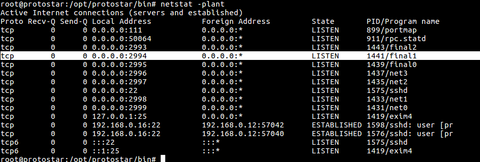
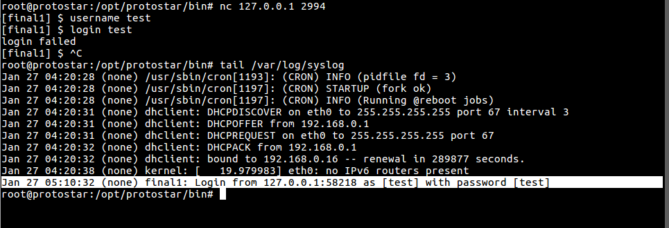
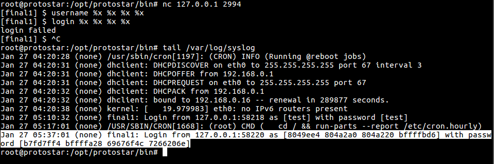
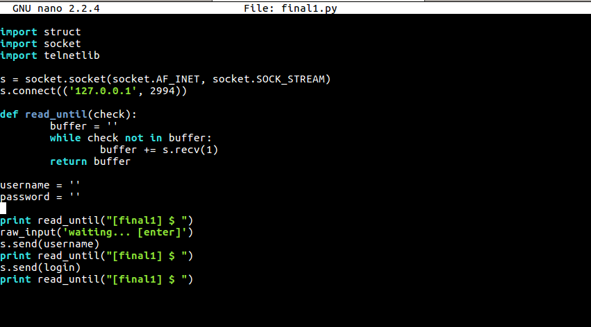
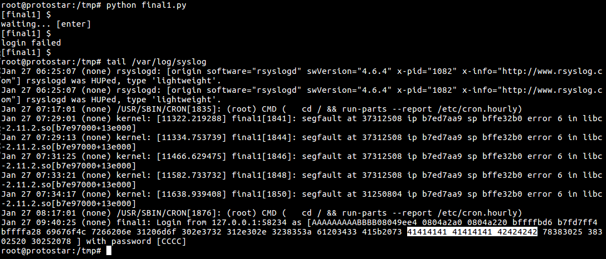
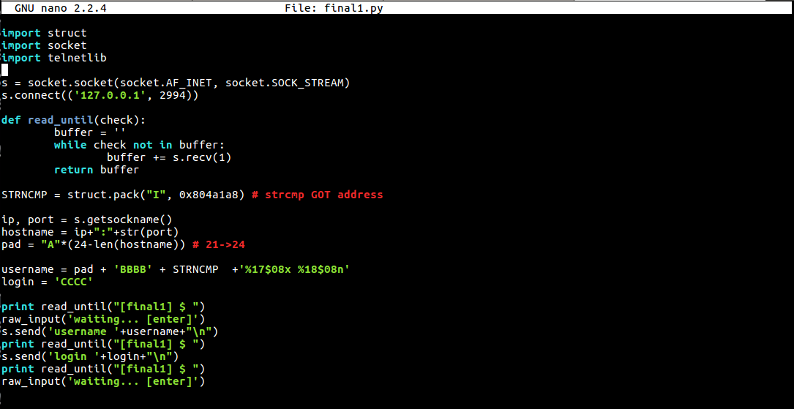
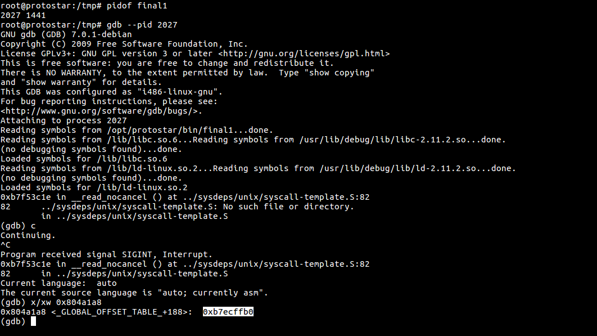
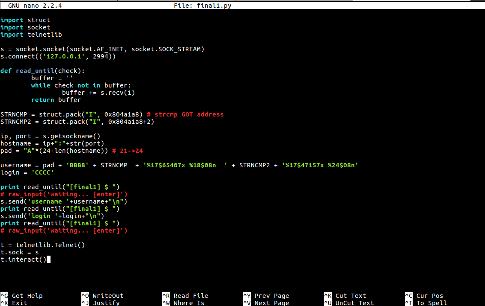
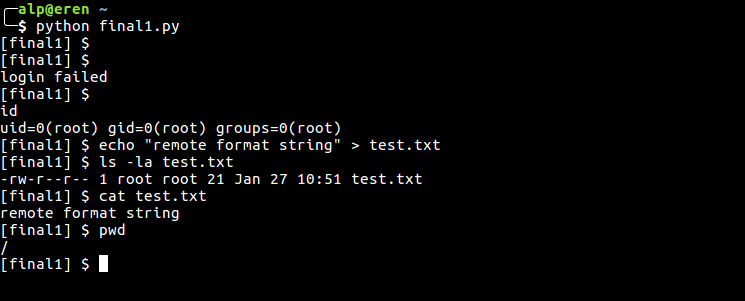

# Final One Writeup

# `Source Code`

Bu soruda `format string` zafiyetinden faydalanmamız ve `remote exploit`'ini yazmamız beklenmekte. (remote blind format string level)

    netstat -plant

Programımızda ufak bir login işlemi tanımlanmış. Eğer username vermeden direk login komutuyla password verip denerseniz size `invalid protocol`, username ve password verip denerseniz `logit()` fonksiyonunu çalıştırıp `login failed` yazacaktır. `logit()` fonksiyonuna baktığımızda ise giriş işleminin `syslog`'a yazıldığını görebiliriz.

Şu şekilde...

Kodumuza bakacak olursak `logit()` fonksiyonunda `snprintf`'de alınan yazılar ve değerler 512 karakterlik bir buffer'a (`buf`) yazılmış. Daha sonra `syslog` içerisine yazmak içinde bu `buff` kullanılmış.

`Input` alanındaki veriler `syslog`'a yazıldığına göre o zaman biz de `format string` saldırılarında kullandığımız `%x` ifadesini programımızda username ve password olarak gönderip `syslog` içerisine nasıl yazıldığına bakalım.

Evet yığından verilerimizi syslog içerisine yazdırmış olduk.

Daha önceki sorularda hatırlayabileceğiniz gib `GOT`'da ki bir adres yerine başka bir adres göndermiştik. Burada programımızın içinde kullanılmış olan `strncmp` fonksiyonu yerine `system` çalıştaracağız.

Ufaktan exploitimizi yazmaya başlayalım...

Kodumuzu çalıştırıp `ps aux | grep final1` komutuyla bakacak olursak 2 tane final1 olduğunu görebilirsiniz. Değeri yüksek olan bizim şuanda çalışan python kodumuzun başlatmış olduğu işlem.

`gdb --pid 1867` komutu ile işlemimizi `gdb` ile açabiliriz. (1867 yazan yere sizin kendi adresinizi yazmnız gerekli)

`GDB` ile programımızı açtıktan sonra `Global Offset Table` içerisindeki `strncmp` adresini bulalım.

Adresimizi bulduk. Bir de `system` adresini bulalım

Username password olarak değer gönderdiğimizde nereden sonra bizim değerimiz yazılıyor bir bakalım.

ip ve port numaraları değişeceği için bunların uzunlukları da değişebilir. O yüzden min ve max uzunluk değerlerine de bir bakalım

Bulduğumuz değerler doğrultusunda exploitimize devam edelim...

`syslog` içerisinde port numarası değişkenlik gösterebilir. Direk kaynak ip ve port almak için `getsockname()` kullanacağız.

ip port uzunluğunda max 21 bulmuştuk ancak sistemimiz 32 bit olduğundan dolayı 4'ün katı bir değer vermek daha sağlık olacak. O yüzden 24 olarak yazdık. Üstte dikkat ederseniz `AAAA` karakterleri hizalı bir şekilde yerleşmemişti. Burada bulacağımız sayı kadar yazacağımız `A` karakteri hizalı yerleşecektir.

username'de gönderdiğimiz uzunluğu strcmp komutunun parametre olarak aldığı `line[128]` 'a göre ayarladık.

`Syslog` çıktısına bakacak olursak `B`'nin karşılığı olan `0x42`'nin 17. sırada yazıldığını görebiliriz.

Şimdi kodumuza bi raw_input daha ekledik. Artık programımız hemen sonlanmayacak. Ve gdb üzerinde iki aşamalı olarak inceleyebileceğiz.

Burada şunu yapıyoruz. Exploitimizi çalıştırdıktan sonra `pidof final1` komutuyla programımızın çalıştığı yeri öğrenelim. Daha sonra `gdb --pid en_yuksek_deger` komutu ile elde etmiş olduğumuz çıktıdaki en yüksek değeri vererek programımızı `gdb` üzerinde açalım. Açıldıktan sonra `x/wx 0x804a1a8` komutuyla çıktımıza bakalım. Ardından gdb üzerinde `c` komutu girelim ve çalışmakta olan final1.py dosyamıza giderek bi enter yapalım ve gdb'mize geri dönerek CTRl+C ile `continue` işlemimizi durduralım ve tekrardan `x/wx 0x804a1a8` komutunu girelim. Bakalım az elde ettiğimiz değer ile şimdi elde ettiğimiz değer aynı mı olacak.

Elde etmiş olduğumuz 0x00000039 değerinin son iki byte'ı `ffb0` yapacağız. (bulmuş olduğumuz system adresinin son 2 byte'ı)

    # update this line
    username = pad + 'BBBB' + STRNCMP + '%17$65407x %18$08n  '

Yukarda yapmış olduğumuz `gdb` üzerinden `continue` komutu girerken exploitimizde enter'a basarak ikinci raw_input alanına gelelim ve tekrardan `gdb`'ye gelerek adresimize bakalım.

Son 2 byte'ı başarılı bir şekilde güncellemişiz. Sıra ilk byte'ı güncellemeye geldi

    # ADD
    STRNCMP2 = struct.pack("I", 0x804a1a8+2)
    # update this line
    username = pad + 'BBBB' + STRNCMP  + '%17$65407x %18$08n  ' + STRNCMP2 + '%17$47157x %24$08n'

`gdb` üzerinden aynı aşamaları takip ederek bakacak olursa `GOT` adresimizin yerine `system` adresimizin geldiğini görebiliriz.

Exploitimizin son hali şu şekilde...

Local

Remote

Ve başarılı bir şekilde exploitimizi çalıştırmış olduk

NOT : Nedenini tam olarak anlamadım ama username değişkeninde `STRNCMP2`'den önce yazdığımız değerin sonunda 2 space ' lik bir boşluk olması gerekiyor.

NOT-2 : Local exploit de ip adresi 127.0.0.1 iken remote exploitimizde ip adresi makinenin ip adresi olmalıdır. Aralarında başka herhangi bir farklılık yoktur
