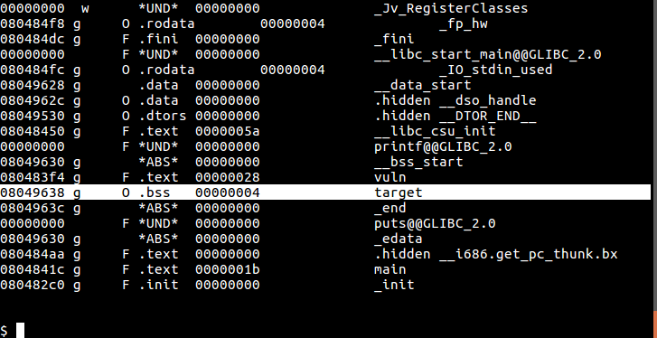
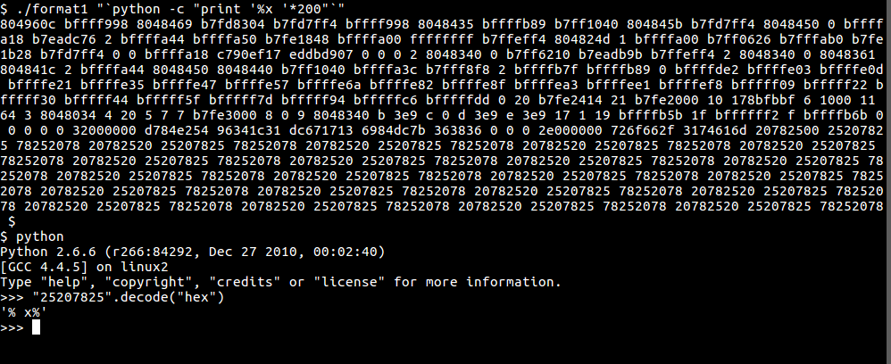

# Format One Writeup

# `Source Code`

Bu soruda target değişkeni printf'den önce verilmiş. Bu yüzden önce target değerini printf'in önüne çekeceğiz ve daha sonra da bunun üstüne değer yazmaya çalışacağız.

Öncelikli olarak target değişkeninin adresini bilmemiz gerek. Bunun içinde soruda bize `objdump -t` komut ve parametresini kullanabileceğimize dair bir ipucu vardı. Bizde bunu kullanarak aradığımız adresi bulup not alalım.

    objdump -t format1

Şimdi programımıza bir sürü değişken girerek `target` adresimizin nerede olacağını bulmamız gerek

Evet belli bir yerden sonra tekrarlayan bir örüntü var. Bu fazlalıkları çıkaralım. Daha sonra stack içerisinde adresleri daha iyi gözlemlemek amacıyla 4 byte'lık A ve B karakterleri yazalım.

Şimdi son değeri `08049638` olacak şekilde ayarlamaya çalışacağız. Burada biraz deneme yanılma yoluyla gideceğim :)

`08049638` değerimizi başarılı bir şekilde yazdırmış olduk. Artık bu değeri en sonda bıraktıktan sonra `%n` ekleyerek `target` değişkenimizin değişmesini sağlayacağız.

Gördüğünüz gibi başarılı olduğumuza dair bir mesaj aldık :)
