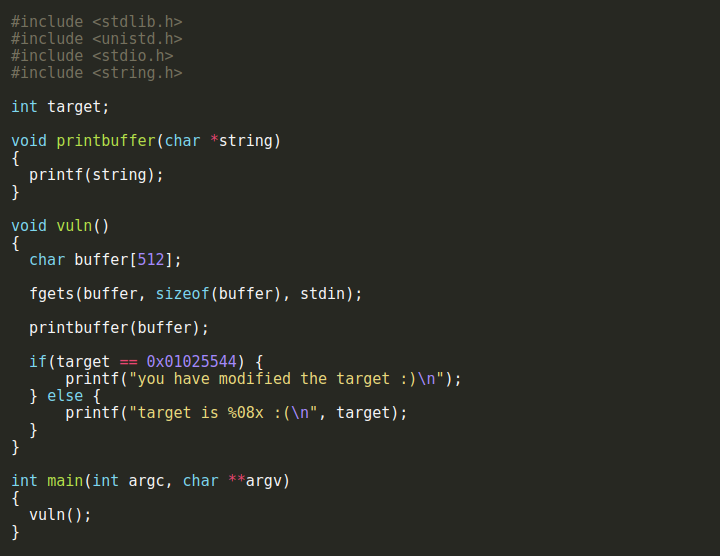
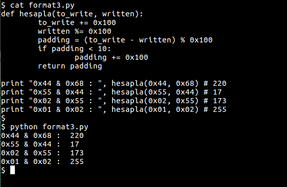

# Format Three Writeup

# `Source Code`

Format2'nin devamı niteliğinde bir soru. Burada target değişkenine 1-2 byte'dan fazla bir değer yazmamız beklenmekte.

Öncelikle `objdump` ile `target` adresimizi bulup not edelim :)

    objdump -t format3 | grep "target"

Şimdi de `%x` göndererek nerden itibaren yazabileceğimizi görelim

Şimdi `target` adresimizi yazalım

Birşeyler gelmeye başladı gibi. Artık `target` değişkenimizi istenen değer yapmaya çalışabiliriz.

Yukarıda yazmış olduğumuz script ile `target` değişkenimizin sadece 1 byte'ını yazmış olduk. Önce 4 byte'ı da ekrana yazdıralım...

Artık her bir byte için yazılan değeri kontrol etme kısmına geçebiliriz.

Burada değerlerimizi verirken iki farklı yol var. Birisi `%u%n%u%n%u%n%u%n` ile diğeri de `%12$n%13$n%14$n%15$n`

# `1. Yol`

Burada ise `%nu` tekniğini kullanıyoruz. Bunun hakkında çok detaylı bilgi edinemedim ancak anladığım kadarıyla her `%nu` stackt'te yer açtığından dolayı bunu doldurmak için her adresimizin önüne `\x01\x01\x01\x01` ekliyoruz.

Şimdi değerlerimizi bulalım. Hatırlayacağınız gibi `target` değişkenimizin adresini ilk başta `58585858` olarak ekrana basmıştı. Eklemiş olduğumuz `\x01\x01\x01\x01` adresi 4 byte ve 4 tane eklemiş olduğumuz için 16 byte'lık bir artış oldu. Bu yüzden ilk elde ettiğimiz `0x58` değerini `16` ile topluyoruz ve `0x68` değerini elde ediyoruz. `0x44` değeri ile `0x68` değerini aşağıda bulunan hesaplama fonksiyonunda işleme soktuğumuzda sonucu `220` olarak göreceğiz.

    def hesapla(to_write, written):
        to_write += 0x100
        written %= 0x100
        padding = (to_write - written) % 0x100
        if padding < 10:
                padding += 0x100
        return padding

Diğer değerlerde sırasıyal `17` `173` `255` olacaktır. Onları da şu şekilde bulduk...

`written` olarak önceki byte'ı ve `to_write` olarak hedef byte'ı verdik.

Bu değerlerin hepsini yerine koyalım.

İstenen `target` değerini başarıyla vermiş olduk.

# `2. Yol`

Burada bir önceki soruda yaptığımız gibi `%12$n...` ile yazacağımız 4 byte'ın hangi adres konumlarına yazılacağını belirtiyoruz.

Burada ise gene en son byte'dan başlayarak yazdırmak istediğimiz byte'dan programın yazmış olduğu byte'ı çıkartacağız ve elde ettiğimiz hexadecimal karakterin decimal karşılığını scriptimizde uygun yere yazacağız.

`0x44 - 0x10 = 0x34` => `52`

`0x55 - 0x44 = 0x11` => `17`

Byte taşmasından yararlanacağız `0x102 - 0x55 = 0xad` => `173`

`0x101 - 0x2 = 0xff ` => `255`

Ve sonunda istediğimiz değeri vermiş olduk ve programımıza `you have modified the target :)` mesajını yazdırdık :)
