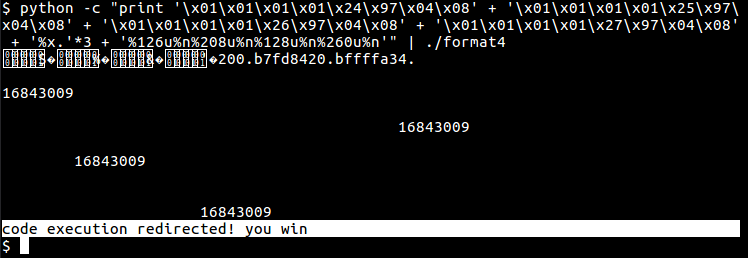

# Format Four Writeup

# `Source Code`

Burada bir işlemdeki yürütmeyi yeniden yönlendirmemiz bekleniyor. Birde `objdump -TR` kullanabileceğimize dair bir ipucu mevcut.

Global Ofset Tablosundaki (GOT) exit() fonksiyonun girişinin üzerine değer yazarak kod çalışma akışına müdahale edebiliriz.

Verilen ipucumuzu kullanalım bakalım bizi ne karşılayacak

    objdump -TR ./format4

Evet burada görebileceğiniz gibi exit() fonksiyonun GOT içerisindeki giriş adresini `0x08049724` olarak bulduk.

Şimdi de stack üzerinde hangi noktadan itibaren değerimizi yazacağız onu bulalım

`exit()`'ın 4 byte'ına değer yazmaya çalışalım

`Segmentation Fault` aldık. Hadi bir de `gdb` üzerinden bakalım

Evet `gdb` üzerinden de `Segmentation Fault` aldık ancak bize lazım olan `0x26262626`'yı öğrenmiş olduk.

Sıra çalıştırmak istediğimiz `hello()` fonksiyonun adresini öğrenmeye geldi.

Çalıştıracağımız fonksiyonun adresini öğrendiğimize göre bir önceki soruda olduğu gibi `%nu` tekniğinde (yani `1. Yol` da) yaptığımız şekilde yazacağımız değerleri hesaplayalım.

Bu değerler sırasıyla `126` `208` `128` `260` olacak.

Gördüğünüz gibi `hello()` fonksiyonumuz çalışmış oldu.
