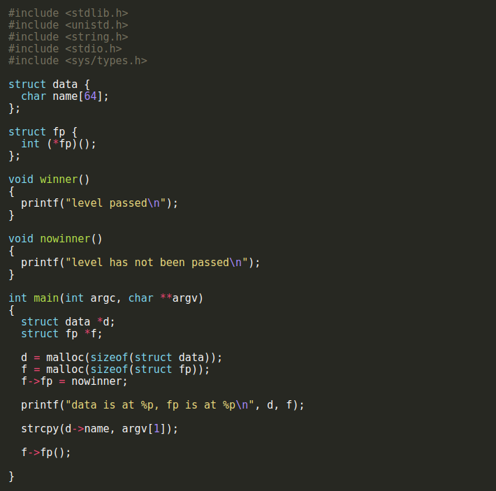
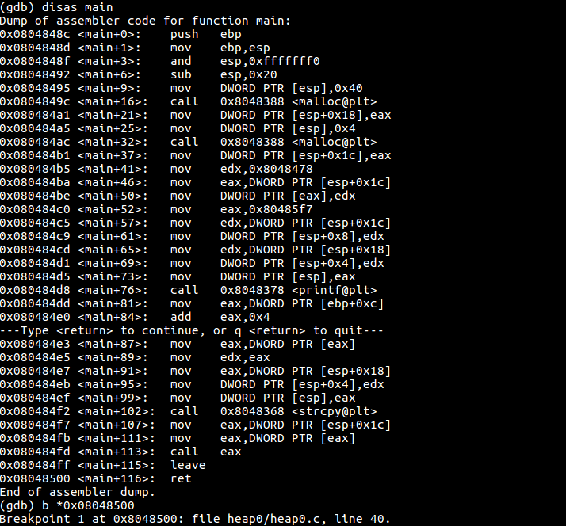
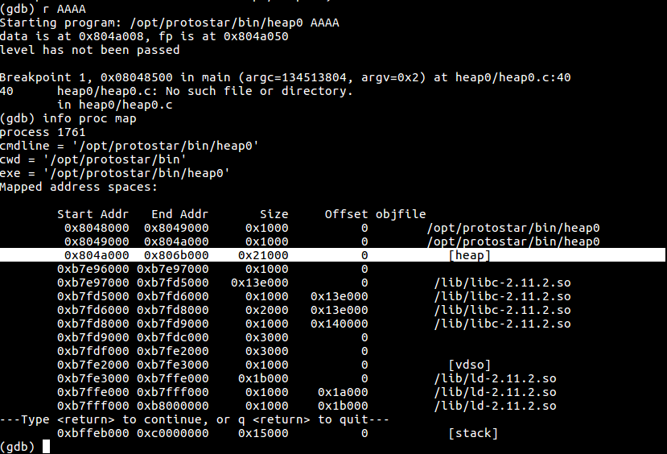
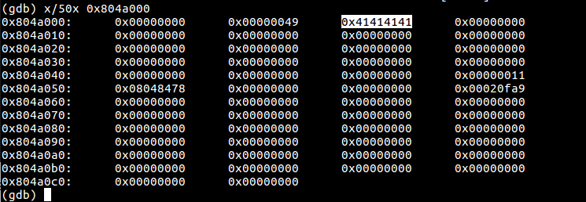

# Heap Zero Writeup

# `Source Code`

Bu soruda basitçe `heap overflow`'un ne olduğunu ve kod akışını nasıl etkileyebileceğimizi göreceğiz. Amacımız kullanılmayan `winner` fonksiyonunu çalıştırmak olacak.

`gdb` ile belleğimizin düzenine bir göz atalım. Burada `main()` işlevimiz dönmeden hemen öncesine bir `breakpoint` atayacağız.

Evet şimdi de `info proc map` komutu ile `heap`'imizin başladığı adresi bulalım.

Girmiş olduğumuz `AAAA` karakterleri `Heap`'de nerede bir de onlara bakalım

`nowinner` fonksiyonumuzun `heap` üzerinde depolandığını görüyoruz. Hemen onunda adresine bakalım. (f->fp = nowinner)

`f->fp()` tarafından yürütülecek olan adresin üzerine `winner()` adresimizi yazabiliriz. Bunun için `64+8` byte yazdıktan sonra `winner()` adresimizi yazacağız.

Gördüğünüz gibi 72 karakterden sonra yazdığımız `CCCC`'nin adresleri geldi. Şimdi `winner` adresimizi öğrenip bunun yerine yazabiliriz.

Ve bu level ' i de başarıyla geçmiş olduk.

NOT : 64'ten sonra yazdığımız 8 byte, `prev_size` ve `malloc_chunk` yapısının boyutunu temsil ediyor.
