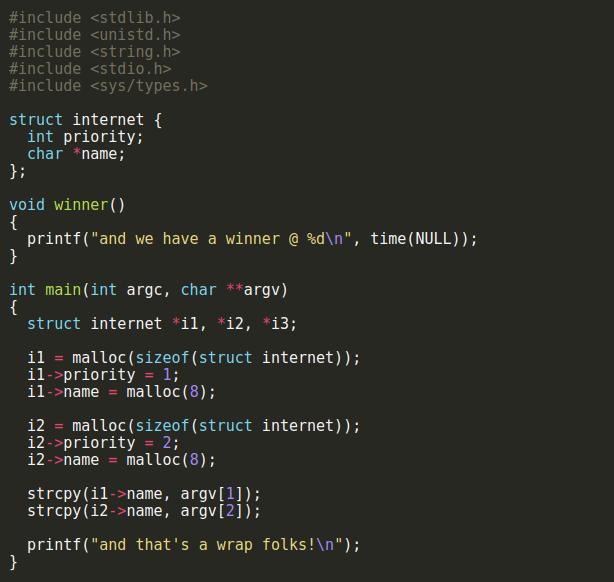
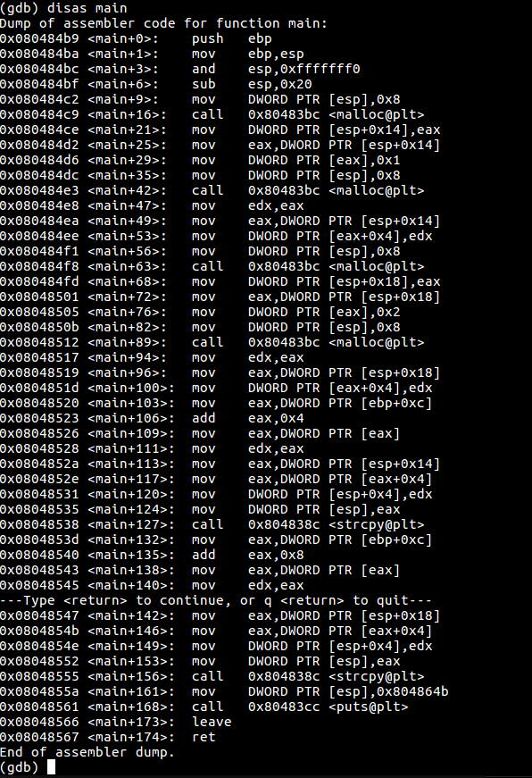
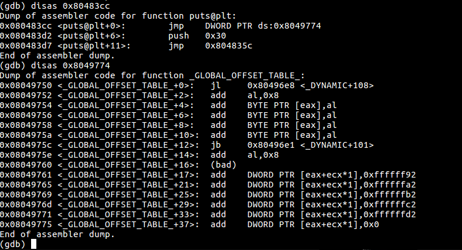
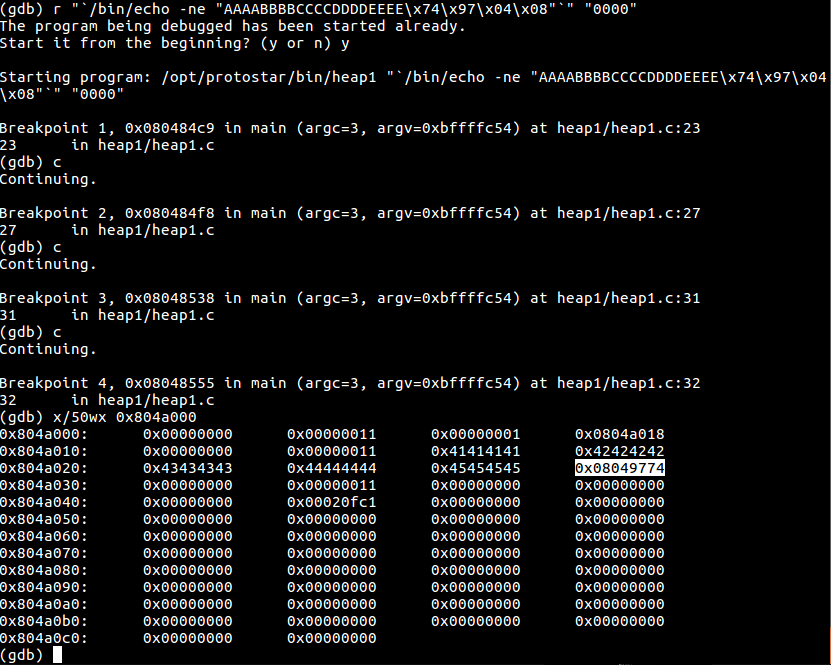
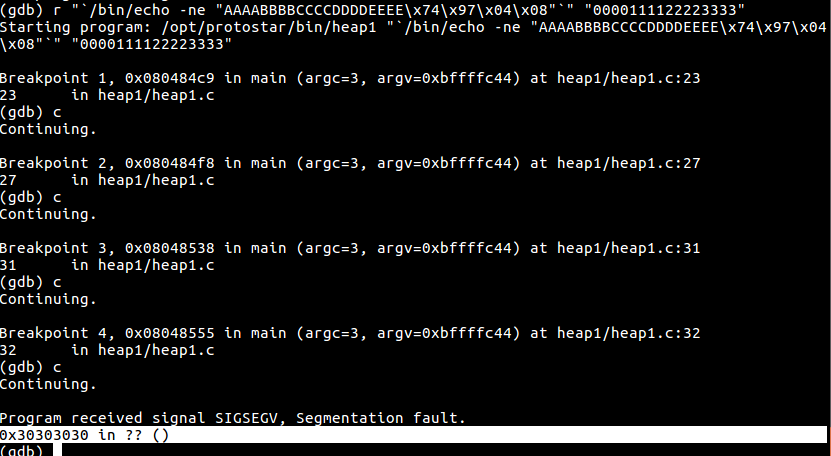
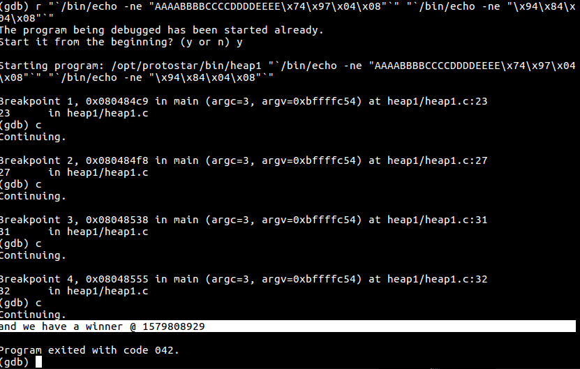

# Heap One Writeup

# `Source Code`

Bu soruda diğerinden farklı olarak bizden 2 argüman almakta ve belirli bir sayıda karakter alan bir buffer'ımız yok. Direk `malloc` ile ayrılmış alanlara müdahale edeceğiz.

Önce `gdb` ile programımızı açalım ve `main` içerisinde neler varmış bakalım.

Şimdi burada `i1` ve `i2` `malloc` adreslerine `breakpoint` atayalım. Ayrıca 1. ve 2. `strcpy` işlemlerine de `breakpoint` atayalım. Bu sayede programımızı rahatça inceleyebileceğiz.

`printf`'imiz `gdb` de `puts` olarak geçiyor. Bu `puts`'un adresini disas komutuyla inceleyelim.

Gördüğünüz gibi bir `jmp` komutu mevcut. Bu komutta bulunan adresi (`0x8049774`) incelediğimizde `Global Offset Table` içerisinde bir adres olduğunu görüyoruz.

`puts` içerisinde `GOT` içerisinde bulunan bir adrese atlıyoruz. Burada yapacağımız şey `0x8049774` adresi bizim `GOT` adresimizi tutarken biz buna `winner` fonksiyonumuzun adresini vereceğiz.

`jmp` işlemi gerçekleştiğinde `0x8049774` Global Offset Table adresine değil `0x8048494` winner adresine sıçramasını sağlayacağız. Bu sayede winner fonksiyonumuz çalışacak

`NOT` : Programı gdb üzerinden çalıştırdıktan sonra belirlediğimiz breakpoint lerde yığınımızda neler değişiyor görmek isterseniz `run veya r` komutuyla `"argüman1" "argüman2"` şeklinde (r "AAAA" "BBBB") çalıştırdıktan sonra `info proc map` komutu ile `heap` adresini öğrenebilir, `x/20wx heap_adresi` komutu ile yığının o anki halini görebilir, bir sonraki breakpoint noktasına geçmek içinde `c veya continue` komutuyla geçiş yapabilirsiniz.

Şimdi yapacağımız şey 8 byte'lık ilk malloc adresini taşırarak ikinci malloc adresinin üstüne istediğimiz adresi/shellcode ' u yazacağız. ( i1 name'e ait 8 byte'lık malloc adresini taşıracağız ve i2 name'e ait malloc adresi yerine yazacağız)

Daha basit anlatacak olursak strcpy komutumuz `strcpy("GOT içerisinde olan adres", "winner fonksiyonumuzun adresi")` haline gelecek. Bu sayede atlanmak istenen GOT adresi yerine programımız vermiş olduğumuz winter adresine atlayacak.

    ...
    i2->name = "GOT address" // i1 name'e verilen 8 byte lık alan taşırılarak buraya istenilen adresin yazılması sağlanacak
    ...
    strcpy(i2->name, argv[2]) // strcpy("GOT address", "winter address")

Artık uygulama kısmına geçebiliriz sanırım. Öncelikle `i1 name malloc` 'a yazmış olduğumuz "AAAA" karakterlerinden sonra `i2 name malloc` 'a kadar kaç byte daha yazmamız gerektiğine bakalım

Saydığımız zaman `20` karakter daha yazmamız gerektiğini görüyoruz.

Yani ilk argümanımız şu şekilde olacak...

    "AAAABBBBCCCCDDDDEEEE\x74\x97\x04\x08"

Ancak burda ufak bir problemimiz var o da bizim görmediğimiz bir `\n` ifadesi olması. Bundan dolayı değerimiz düzgün yerleşmiyor yığına. Bu problemi çözmek için `/bin/echo` kullanacağız. Yani şu şekilde olacak...

    "`/bin/echo -ne "AAAABBBBCCCCDDDDEEEE\x74\x97\x04\x08"`"

Ve sonuç şu şekilde olacak...

Başarılı bir şekilde yığının içerisinde i2 name'e ait bölüme `Global Offset Table` içerisinde olan adresimizi vermiş olduk.

Sırada argv[2] 'miz yığın içerisinde nerede bulunuyor ve kaç byte 'dan sonra winner'ımızın adresini yazmamız gerekecek bunu öğrenelim

`0x30` => `0`

İlk 4 byte'da hata verdi yani argv[2] olarak herhangi bir karakter girmeden direk `winner` adresimizi verebiliriz.

`\n` olayı burada da geçerli olduğu için `/bin/echo` kullanacağız.

    "`/bin/echo -ne "\x94\x84\x04\x08"`"

Son hali ise şu şekilde olacak...

    ./heap1 "`/bin/echo -ne "AAAABBBBCCCCDDDDEEEE\x74\x97\x04\x08"`" "`/bin/echo -ne "\x94\x84\x04\x08"`"

Ve gördüğünüz gibi başarılı bir şekilde `winner` fonksiyonumuzu çalıştırmış olduk.
