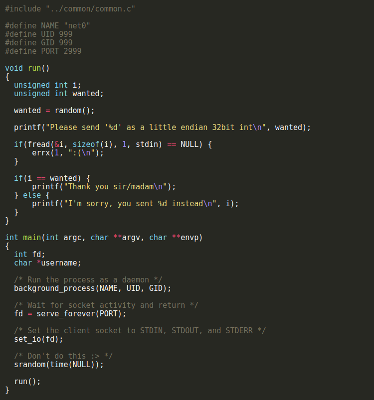
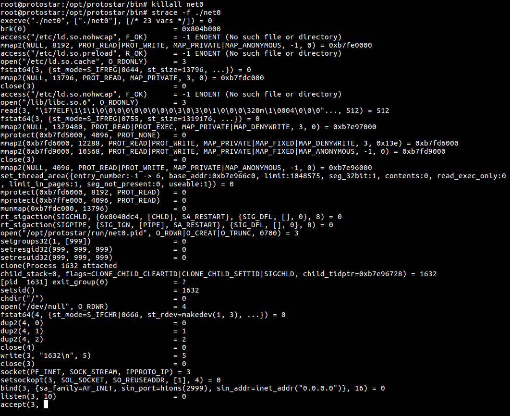
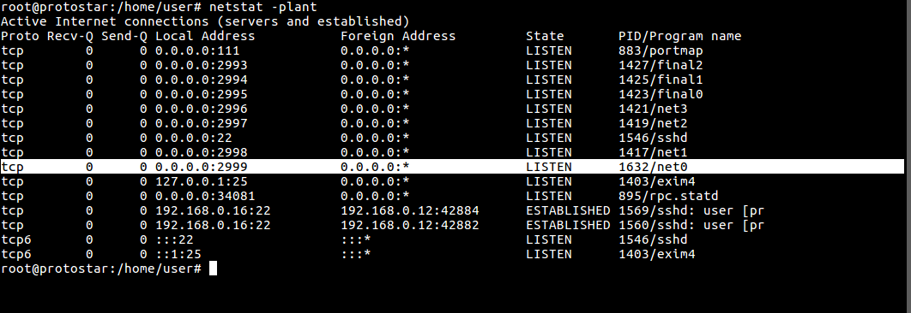

# Net Zero Writeup

# `Source Code`

Programımızı ilk çalıştırdığımızda herhangi birşey olmuyor. Arkada çalışan işlemlere bakalım herhangi birşey var mı

Sistemde root olalım . Parola `godmode`

Önce bi `strace` komutuyla programımıza bir bakalım.

    strace -f ./net0

Burada görebileceğiniz gibi `socket` işlemi var. Bu yüzden bir de `netstat` komutu ile bakalım.

`netcat` ile bağlantı kurmaya çalıştığımızda ne olacak...

Kodumuza tekrar bakacak olursak her bağlanma talebinde `run` fonksiyonu çalışıyor. Bu fonksiyonumuzun içerisine baktığımız zamansa `i` değişkeninin `wanted` değişkenine eşit olması durumunda istediğimiz mesajı ekrana bastırabileceğiz.

Bize `nc` ile bağlantı kurmaya çalıştığımız zaman `random()` ile atanan `wanted` değişkenini ekrana yazıyor. Bir değer girdikten sonra ise girmiş olduğumuz değeri ekrana basıyor.

Yazmamız gereken doğru değeri bulmak için python'da bulunan struct kütüphanesini kullanacağız. Bu kütüphanede bulunan ve daha önce de kullandığımız pack fonksiyonuna programın bize vermiş olduğu random adresi yazarsak eğer bizden istenen doğru değeri elde etmiş olacağız. Ancak burada `nc` komutumuzu direk çalıştırdığımız zaman doğru almıyor o yüzden burada da ufak birşeyler ekleyeceğiz.

  

    import struct
    struct.pack("I", 114423126)

Gelen değeri programımıza verdikten sonra CTRL+D yaparsanız istediğimiz mesajı ekrana yazacaktır.
