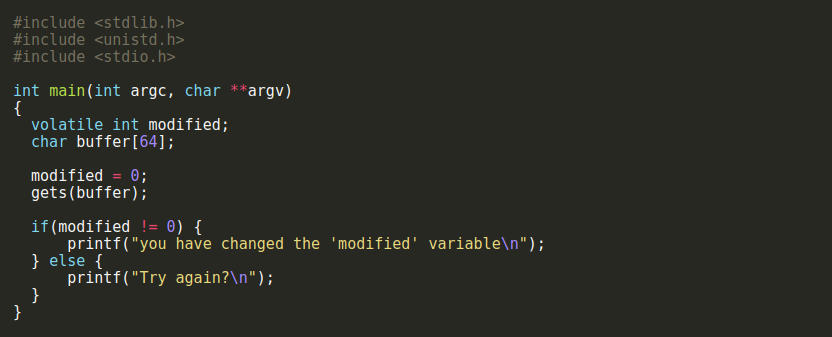

# Stack Zero Writeup

# `Source Code`

Bu soruda amacımız programın ekrana `you have changed the 'modified' variable` yazmasını sağlamak. Bunu yapabilmek için `modified` değerinin 0 dan farklı bir değer olması gerekmekte.

Burada kullanılan `gets()` fonksiyonu `stack frame`'i istediğimiz gibi doldurabilmemizi sağlıyor. Programdaki fonksiyonların lokal değişkenleri stack içerisine atılır ve programdaki fonskiyonların kendilerine ait `stack frame`'leri bulunur. Bu sayede programın içindeki fonksiyonlar birbirlerinin değişkenlerine erişemezler.

Ufak bir bilgilendirmenin ardından artık çözüme geçebiliriz. Yapacağımız şey gayet basit. `gets()` fonksiyonunu kullanarak aynı `stack frame` içerisinde bulunan `modified` değişkenini değiştireceğiz. Bunun içinde yapmamız gereken tek şey bizden istenen 64 karakteri `(buffer[64])` doldurduktan sonra yazmaya devam etmek olacak.

Evet gördüğünüz gibi 64 tane A karakteri gönderdiğimizde `Try again?` yazarken 65 tane A karakteri gönderdiğimizde istediğimiz `you have changed the 'modified' variable` yazısını ekrana yazmış oldu.

***
Not: `modified` değişkeni 4 byte olduğu için sadece 1 karakter daha yazmamız yeterli oldu. Eğer buffer ve 4 byte'lık `modified` değişkenini değiştirdikten sonra karakter girmeye devam edersek `segmentation fault` hatası alırız. Bu hatayı almamızın sebebi de programın kendi hafıza alanı dışındaki bir alana erişmeye çalıştığı zaman işletim sisteminin müdahale etmesidir.   
***
