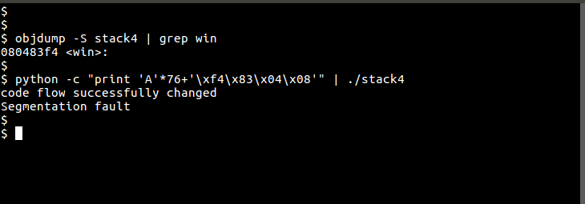

# Stack Four Writeup

# `Source Code`

Burada bizden main fonksiyonu içerisinde bulunan stack'imizi taşırarak `eip` değerini değiştirmemiz bekleniyor.

Önceki sorudaki gibi değiştirebileceğimiz bir fp değişkenimiz olmadığı için `eip registerının` stack'te bulunduğu yeri doldurup programı manipüle etmeliyiz. Bunun içinde şimdiye kadar yaptığımız gibi lokal değişkene değil stack'te bulunan dönüş adresini değiştireceğiz.

Evet sanırım bu kadar açıklama yeter. Şimdi programa 64 den daha fazla karakter gönderip sistemin `segmentation fault` hatası vermesini sağlayacağız. Daha sonra da belirtmiş olduğumuz geri dönüş adresini bulacağız.

Ve bingo ! 76 byte'dan sonra `eip registerının` üzerine yazılan alan geliyor. Bir önceki yazıda olduğu gibi `win` fonksiyonunun adresini tespit edip programımızı manipüle edebiliriz.

`Not :`

Programda fonksiyon çağrılmadan önce fonksiyon parametreleri stack'e yazılır. Daha sonra fonksiyona girilmeden önce dönüş adres değeri stack’e atılır ve dönüş adres değeri fonksiyon sonlanırken tekrar çağırılarak program çalışmasına devam eder.

Klasik arabellek taşmasında ise fonksiyondaki lokal değişkenleri tutmak için oluşturulan buffer alanı taşırılarak `eip` değerine istenen bir değerin yazılması ve böylece program akışının değiştirilmesi sağlanır.
