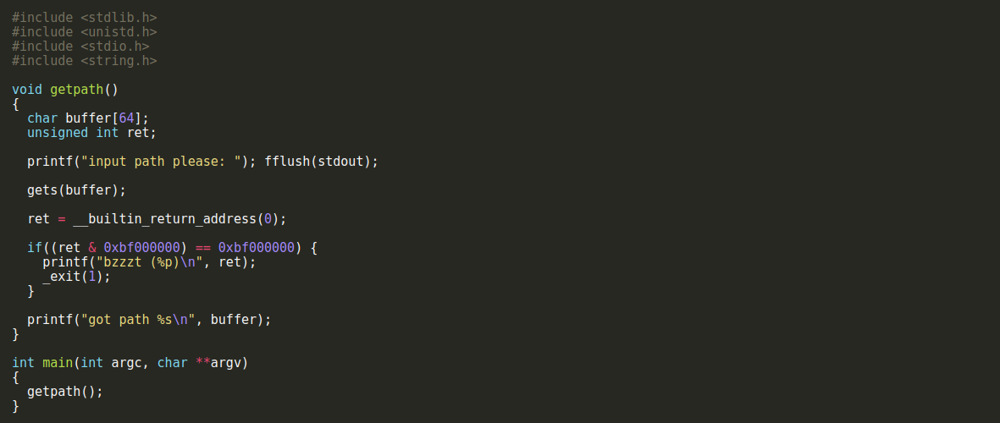
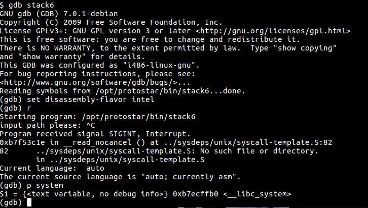
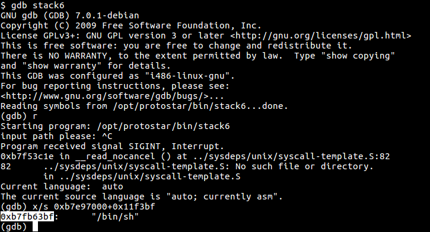

# Stack Six Writeup

# `Source Code`

Burada dönüş adresi kısıtlamaları olduğunda neler yapabileceğimizi göreceğiz. [Soruda](https://exploit.education/protostar/stack-six/) bize ipucu olarak birkaç yöntem söylenmiş. Ben burada `ret2libc` üzerinden çözümü anlatacağım.

Yığından geçerli dönüş adresi gelirse o zaman `0xbf` ile `AND` işlemine girer ve sonuç tekrardan `0xbf` ile karşılaştırılır. Eğer koşul sağlanırsa bu dönüş adresini yazdırır ve çıkış yapar (programdan çıkar). Bu nedenle `0xbf` ile başlayan adres kullanamayız.

Şimdi programımızı `gdb` ile açarak `getpath` ' de çalıştıralım. Ve daha sonra haritamıza bakalım.

    gdb stack6
    set disassembly-flavor intel
    break *getpath
    run
    info proc map
**

`0xbf` ile başlayan tek adres olduğunu görebiliriz (Yığında) (temelde bir yığın adresine geri dönemeyiz).

NOT-1 :Burada seçili olan adrese daha sonra ihtiyacımız olacak. (`libc`'nin başladığı adres)

NOT-2 : `find 0xb7e97000, +9999999, "/bin/sh"` komutu ile arama işlemi gerçekleştirebilirsiniz. Ancak gelen değeri `x/s adres` komutu ile baktığınızda orada `/bin/sh` 'ın orada olmadığını görüyoruz.

En başta söylediğim gibi ipuçlarından birinde bize `ret2libc`'ye bakabileceğimizi söylemişti. Bizde bunu kullanacağımız için `gdb` üzerinden `p system` ile adresini buluyoruz. (libc_system kütüphanesinde bulunan system fonksiyonunun adresi)

Evet `"/bin/sh"` ifadesini kullandığı bilinen bir dizgeye ihtiyacımız var  ve yukarıda `NOT-2` de gdb üzerinde `find` komutu ile `"/bin/sh"` adresini bulmak istediğimiz zaman verimli bir sonuç elde edememiştik.

`libc` kütüphanesi `"/bin/sh"` dizesini içerir. Bu yüzden farklı bir yol deneyeceğiz.

`libc` içindeki tüm dizeleri bulmak için `strings` komutunu kullanabiliriz. `-a` parametresi hepsini getir anlamındadır. `-t x` parametresi ile de içindeki offseti yazdırabiliriz (hex olarak).

 `info proc map` ve `strings` komutuları ile elde etmiş olduğumuz bu değerleri de topladığımız zaman `/bin/sh` için gerçek adres değerimizi elde etmiş olacağız.

Artık bulmuş olduğumuz değerleri kullanarak exploitimizi yazabiliriz.

`padding`'imizi hazlıyoruz. Toplamda 80 karakterimiz olacak.

Sistem adresimizi (`system`) ekledik

`Segmentation Fault` almamak için birkaç `A` daha ekliyoruz. (buradaki return işlemi fonksiyondan çıktıktan sonra dönülmesi istenilen yeri temsil eder , herhangi bir dönüş değeri istemediğimizden rastgele 4 byte verdik)

Daha sonra system() fonksiyonumuza /bin/sh argümanını vermek istediğimizden bulmuş olduğumuz /bin/sh adresimizi (`bin_sh`) ekledik

En son sırasıyla değerlerimizi `print` ile yazdır diyerek exploitimizi bitiriyoruz. Artık çalışmaya hazır.

Ve gördüğünüz gibi exploitimiz başarılı bir şekilde çalışmış oldu.
