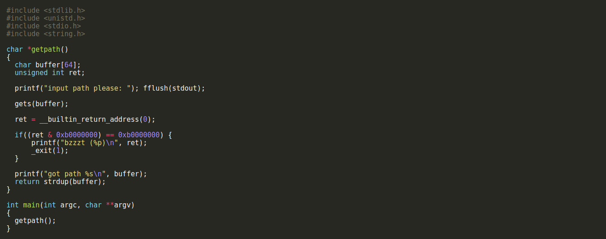
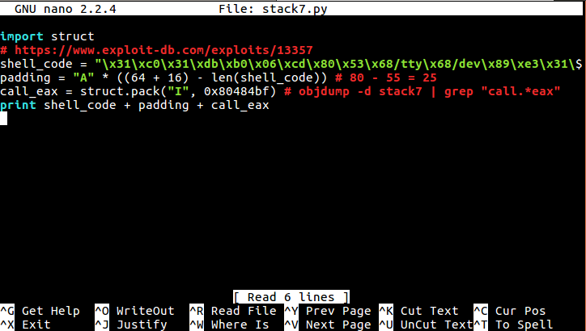
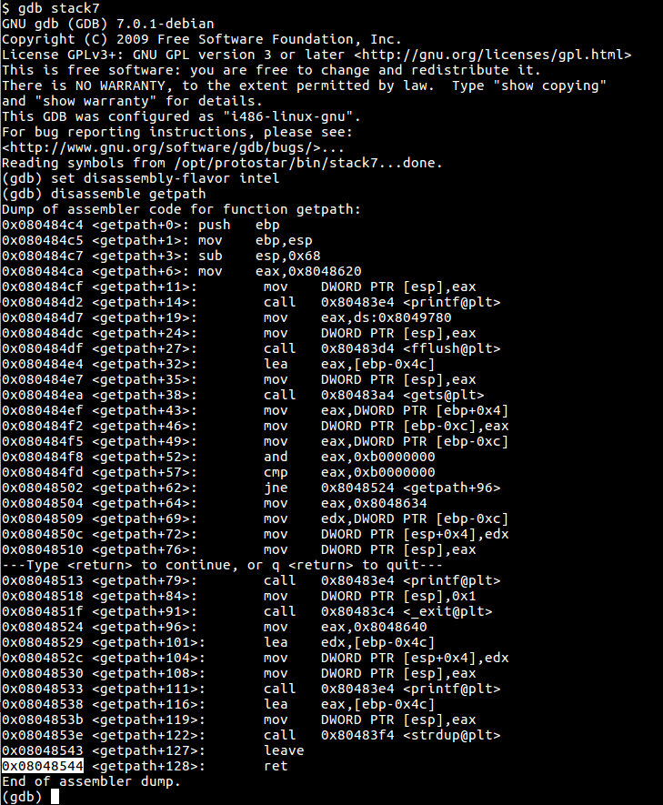
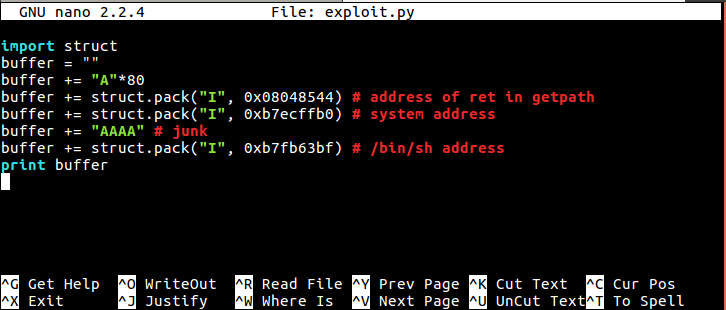

# Stack Seven Writeup

# `Source Code`

Bir önceki soruyla benzer bir soru. if bloğu içerisinde `0xbf` yerine `0xb` ile karşılaştırma yapılmış. Ve farklı olarak return ile `strdup` fonksiyonunun kullanıldığını görmekteyiz. (strdup fonksiyonu buffer'da bulduğu dizeyi çoğaltacak ve yeni dizenin adresini return ile döndürecektir.)

[Soruda](https://exploit.education/protostar/stack-seven/) bize gene kullanabileceğimiz ipuçları verilmiş. Bunların içerisinden `objdump`' ı kullanarak oldukça kısa bir çözüm elde etmeye çalışacağız.

Fonksiyonlar normalde çıkışını `eax` kayıt defterini kullanarak döndürür. Böylece shellcode'u buffer'a yerleştirip `ret` adresinin üzerine yazabiliriz.

Bu yüzden amacımız kod yürütmesini döndürülen dizeye yönlendirmek olacak. (İşlevler genellikle EAX'a döndüğünden) Bir `jmp %eax` veya `call %eax` arabelleğimizdeki kabuk kodunu çalıştıracaktır.

`objdump` yardımıyla bir `call %eax` arıyoruz.

    objdump -d stack7 | grep "call.*eax"

**

Değerimizi bulduk.

Sıra exploitimizi hazırlamaya geldi

Gets() içinde stdin'den dönen bir shellcode kullanacağız ve `/bin/sh`'ı çalıştıracağız.

Dönüş adresi olarak `call eax`'ı şu adreste(0x8048bf) kullanacağız

Ve bu şekilde exploitimizi hazırlamış olduk.

Artık exploitimizi çalıştırarak test edebiliriz.

Exploitimiz başarılı bir şekilde çalışmış oldu.

# `ret2libc`

Farklı bir bakış açısı olması için bir de `ret2libc` tekniği üzerinden exploitimizi hazırlayalım.

Arabelleğe yeterince veri yazarsak dönüş adresini bizim seçtiğimiz bir adresle üzerine yazabilir ve getpath() içinde `ret` yürütüldüğünde kod yürütebiliriz.

Bu yüzden getpath()'de bulunan `ret` adresini bularak bir kenara not ediyoruz.

libc_system kütüphanesindeki `system` adresini dönüş adresi olarak ve stack'i `/bin/sh` argümanını çalıştıracak şekilde ayarlayacağız.

Dönüş adresi olarak bir `ret` komutunun adresini kullanırsak  stack'de ki bir sonraki adrese atlarız. Bu nedenle sistem adresinden önce bir `ret` komutunun adresini exploitimize ekleyeceğiz.

Burada vermiş olduğumuz değerleri stack6'dan hatırlayabilirsiniz. Stack6'dan farklı olarak exploitimize sadece getpath()'de bulunan `ret` adresini ekledik. (Sistem adresi ve /bin/sh adresini bir önceki yazıda bulmuştuk)

Ve gördüğünüz gibi exploitimiz başarılı bir şekilde çalışmış oldu.
